# Atos Lins

Developer from Araraquara, Brazil. I build tools for the Linux desktop
(Omarchy / Hyprland), plugins that keep AI coding agents honest, and the
automation behind a company's day-to-day operations.

> **PT-BR** · Desenvolvedor em Araraquara (SP). Faço ferramentas para o desktop
> Linux (Omarchy / Hyprland), plugins que mantêm agentes de IA honestos e a
> automação do dia a dia de uma empresa.

## Featured · Destaque

### [WhatsApp for Omarchy](https://github.com/atoslins/Omarchy-WhatsApp-v2)

WhatsApp, native to the Omarchy shell. Not a browser tab. Opens instantly and
works offline from a local mirror, replies from the bar, handles several
accounts, and ships an MCP server so agents can read and send messages.
Built on [OmaWhatsApp](https://github.com/MoizIbnYousaf/Omarchy-Whatsapp) by MoizIbnYousaf.

[v0.15.0](https://github.com/atoslins/Omarchy-WhatsApp-v2/releases/tag/v0.15.0) is out ·
[Submitted to the Omarchy plugin store](https://github.com/omacom/omarchy-plugin-marketplace/issues/8842)
 WhatsApp nativo no Omarchy, sem aba de navegador: abre na hora, funciona offline e responde pela barra.

## Contributions · Contribuições

### [Omarchy: Windows VM launch fix](https://github.com/omacom/omarchy/pull/12323)

Merged into [omacom/omarchy](https://github.com/omacom/omarchy) by DHH.
`omarchy windows vm launch` exited 1 with no output whenever `~/Windows` was
setgid, which is how the Windows container itself leaves the folder after the
first run. A numeric `chmod 0700` keeps setgid on directories, so the
exact-mode check could never pass. The fix hardens with a symbolic mode, says
which directory failed and why, and ships regression tests for both paths.
Closes [#9334](https://github.com/omacom/omarchy/issues/9334).
 Correção aceita no Omarchy: a VM do Windows falhava em silêncio quando `~/Windows` tinha setgid. Mergeada pelo DHH, com testes de regressão.

Also: [awesome-claude-code#46](https://github.com/jmanhype/awesome-claude-code/pull/46) and [awesome-claude-plugins#236](https://github.com/composio-community/awesome-claude-plugins/pull/236), DoD-Guard listing.

## Projects · Projetos

### [DualSense for Omarchy](https://github.com/atoslins/omarchy-plugin-dualsense)

The PS5 DualSense in the Omarchy bar: battery, lightbar, player LEDs, adaptive
triggers, rumble, mic and speaker, plus a live input tester. USB-C and
Bluetooth, no extra packages.
 O controle do PS5 na barra do Omarchy: bateria, luzes, gatilhos adaptativos e testador de botões.

### [Método](https://github.com/atoslins/metodo)

Claude Code plugin against the three ways coding agents fail to persevere:
giving up at the first obstacle, settling on a solution too early, and
delivering half the job. Three protocols, a gap ledger whose items close only
when a proof command exits 0, and a Stop gate. Measured with and without the
plugin in `claude plugin eval`.

[v1.0.0](https://github.com/atoslins/metodo/releases/tag/metodo--v1.0.0) is out
 Plugin do Claude Code contra as três falhas de perseverança de agentes: desistir no primeiro obstáculo, fechar a solução cedo e entregar pela metade.

### [DoD-Guard](https://github.com/atoslins/dod-guard)

Definition of Done as an executable barrier for Claude Code. Hooks and
read-only reviewer agents stop the agent from declaring a task done while
stubs, skipped tests or unproven claims remain.
 Definição de pronto como barreira executável: o agente não declara a tarefa concluída com código pela metade.

## Stack

Python · TypeScript · PHP · Go · QML / Quickshell · Shell
 Linux (Arch / Omarchy) · Docker · PostgreSQL · ClickHouse
